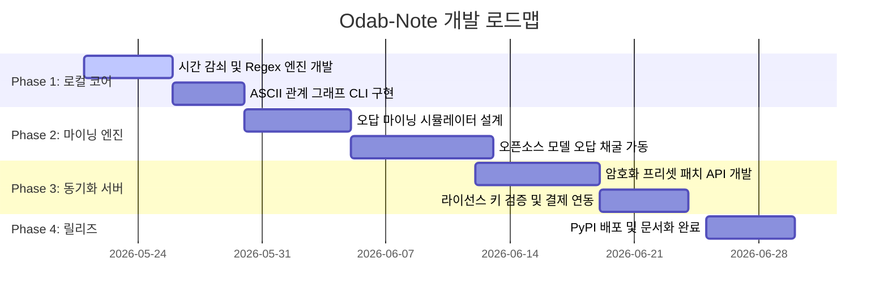

# Work Breakdown Structure (WBS) & 개발 로드맵

오답노트(`Odab-Note`) 솔루션의 고도화, 비공개 오답 채굴 시뮬레이터 구축, 그리고 동기화 서버와 요금제 검증까지의 전체 개발 태스크 및 타임라인을 정의합니다.

---

## 1. 개발 마일스톤 (Milestones)

---

## 2. 세부 작업 분할 (Work Breakdown Structure)

### Phase 1: 로컬 코어 고도화 (1.5주) - 담당: Codex-CC / 프로젝트팀
* **1.1: 데이터베이스 스키마 보강 및 마이그레이션**
  * `target_model`, `last_occurred_at`, `decay_factor` 컬럼 추가 및 마이그레이션 예외처리 수립. (완료)
  * `apply_decay()` 가중치 감쇠 비즈니스 로직 작성. (완료)
* **1.2: 정규식 스택 트레이스 매칭 엔진 구현**
  * `re.compile` 기반 대소문자 및 줄바꿈 대응 패턴 매칭 작성. (완료)
  * 에이전트 연동용 `match_error_trace` MCP 툴 탑재. (완료)
* **1.3: ASCII 관계 그래프 CLI (`odab-note graph`) 개발**
  * 오답 DB 간의 `from_note_id` - `to_note_id` 관계 릴레이션 매핑 DFS/BFS 트리 순회 모듈 작성.
  * CLI 트리뷰 포맷터 구현.

### Phase 2: 오답 마이닝 시뮬레이터 (Simulator Test-bed) 구축 (2주) - 담당: Elbon / CC
* **2.1: 자동 컴파일 실패 시뮬레이터 설계**
  * 4B/8B 모델(Ollama/vLLM 연동)을 구동하고 특정 언어(Python, TS, Rust)의 복잡한 컴파일 미션을 무한 호출하는 자동화 스크립트 작성.
* **2.2: 오답 채굴 및 데이터 정제 툴링**
  * 시뮬레이터 동작 도중 유발된 에러와 수정 코드 쌍(Sol)을 모아서 중복 제거 및 마이닝 팩(JSON)으로 정제하는 파이프라인 개발.
* **2.3: 프리셋 파일 암호화 패키징**
  * 비공개 지식 자산을 위해 마이닝된 프리셋 데이터를 AES-256 등으로 패키징하는 인코더 작성.

### Phase 3: 프라이빗 Sync API & 라이선스 서버 구축 (1.5주) - 담당: 공통 백엔드팀
* **3.1: 프리셋 배포용 경량 API 서버 개발**
  * 라이선스 인증 상태에 따라 모델별 프리셋 JSON을 반환하는 FastAPI 서버 구축.
  * 사용자 로컬 CLI에서의 `odab-note pull --model <model>` 프로토콜 및 복호화 툴 연동.
* **3.2: 라이선스 & 결제 연동 (Lemon Squeezy 또는 Stripe)**
  * 개인 개발자를 위한 간편 결제 창구 셋업 및 결제 완료 시 webhook을 받아 라이선스 DB에 키 발행 자동화.

### Phase 4: 패키징, 배포 및 마케팅 (1주) - 담당: CC 운영관제팀
* **4.1: CLI 패키지 릴리즈**
  * `pyproject.toml` 기반 빌드 후 PyPI(pip)에 `odab-note` 정식 업로드.
* **4.2: GitHub 오픈소스 리포지토리 홍보 문서 작성**
  * 매력적이고 직관적인 영문 README.md, CLI 데모 GIF, MCP 서버 연동 JSON 가이드 추가.
  * Reddit, HackerNews 등 개발자 커뮤니티 배포 런칭.
